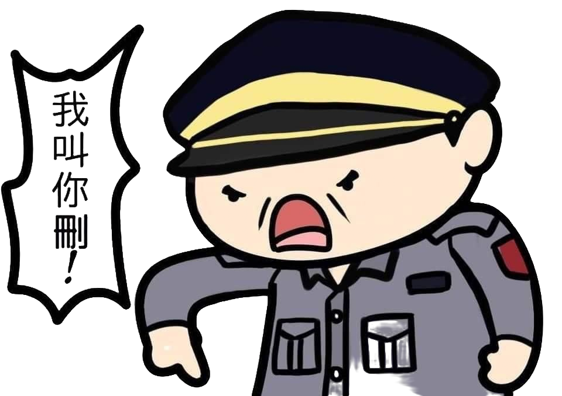

# Cyberpunk2077-ShingekinoTSJ

跟著王警官打敗邪惡的 TSJ 和壞蛋警察吧！

[//]: # (***跟著王警官打敗邪惡的 TSJ 吧！***)

[//]: # (![]&#40;src/main/resources/PoliceWang.png&#41;)
王警官

邪惡的 TSJ

壞蛋警察

## 遊玩說明
王警官碰到 1 次 TSJ 或是讓 TSJ 跑出螢幕外生命會減少 1 
 
可以射擊子彈打死 TSJ
 
打死一隻 TSJ 可以加 1 分
 
 小心！隨著分數提高 TSJ 也會越來越多

### 鍵盤控制
#### 標題畫面

- `ALT` + `S` 是點擊 Start 按鈕的快捷鍵，開始遊戲
- `ALT` + `L` 是點擊 Leave 按鈕的快捷鍵，離開遊戲

#### 暫停畫面

- `ALT` + `R` 是點擊 Resume 按鈕的快捷鍵，回到暫停的遊戲畫面，按下 `ENTER` 繼續遊戲
- `ALT` + `M` 是點擊 Menu 按鈕的快捷鍵，回到標題畫面
- `ALT` + `L` 是點擊 Leave 按鈕的快捷鍵，離開遊戲

#### 遊戲畫面

- 按著 `W` 或是 `UP` 向上
- 按著 `S` 或是 `DOWN`  向下
- 按著 `A` 或是 `LEFT`  向左
- 按著 `D` 或是 `RIGHT`  向右
- 按下 `J` 或是 `SPACE`  射擊
- 按下 `P` 暫停遊戲，遊戲畫面切到暫停畫面
- 按下 `ENTER` 繼續遊戲
- 按下 `Q` 關閉遊戲

